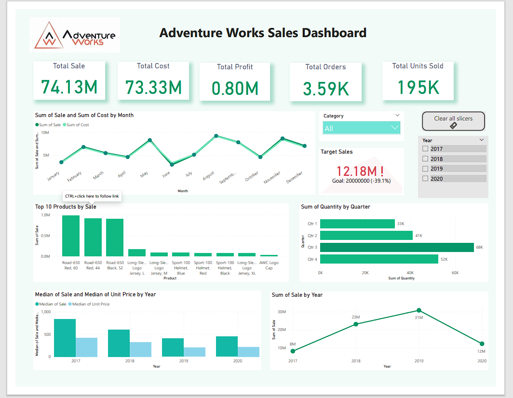

# Adventure-Works-Sales-Dashboard
### I built an interactive Sales Performance Dashboard using Power BI based on the Adventure Works dataset.

📊 Key insights from the dashboard:
• Total Sales: 74.13M
• Total Cost: 73.33M
• Orders Processed: 3.6K
• Units Sold: 195K

📈 The dashboard highlights:
• Monthly sales vs cost trends
• Top performing products
• Quarterly quantity distribution
• Yearly sales performance
